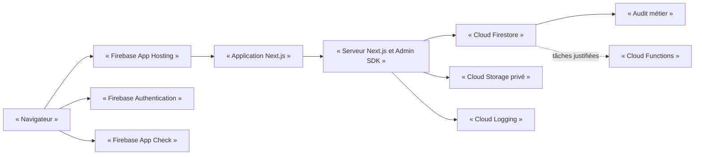

# Architecture technique Firebase du CRM communautaire

## 1. Objet du document

Ce document traduit l’architecture fonctionnelle approuvée dans les documents 01 à 08 en architecture technique. Firebase est retenu pour le MVP. Cette description n’est ni une configuration déployée, ni une validation juridique. Aucun module financier, original d’archive ou stockage sensible n’est autorisé à ce stade.

## 2. Principes architecturaux

- Moindre privilège et refus par défaut.
- Comptes nominatifs et séparation des responsabilités.
- Cloisonnement strict des organisations.
- Mutations sensibles exclusivement côté serveur.
- Traçabilité des décisions et minimisation des données.
- Identifiants métier stables et réversibilité documentée.
- Projets distincts pour développement, préproduction et production.

## 3. Architecture générale

Firebase App Hosting exécute Next.js. Authentication établit l’identité ; le serveur échange l’identité contre un cookie de session sécurisé. Firestore porte les données métier et Storage les fichiers. Les Security Rules protègent les accès directs des SDK clients. App Check réduit certains abus. Cloud Functions reste réservé aux tâches asynchrones démontrées ; Cloud Logging complète, sans remplacer, l’audit métier Firestore.

## 4. Frontières de confiance

### Interface utilisateur

L’interface peut masquer une fonction ou guider l’utilisateur. Elle ne constitue jamais un contrôle d’autorisation et toute requête peut être reproduite hors interface.

### Serveur Next.js

Le serveur vérifie la session, relit l’état du compte, les rôles, appartenances et affectations, contrôle les transitions et réalise les mutations sensibles. Une couche d’accès aux données centralise ces décisions.

### Firebase Admin SDK

L’Admin SDK contourne les Security Rules Firestore et Storage. Toute opération privilégiée doit donc être autorisée dans la logique serveur avant son exécution. Une règle Firebase ne compense jamais un défaut d’autorisation serveur. Les comptes de service doivent recevoir uniquement les permissions nécessaires.

### Security Rules

Les règles protègent les accès directs effectués par les SDK clients. Elles sont en refus par défaut et forment une barrière indépendante. Elles ne protègent pas une opération exécutée avec l’Admin SDK. Leur couverture doit être testée séparément de celle du serveur.

### App Check

App Check atteste le client ou l’application et réduit certains abus. Il ne prouve pas l’identité et ne remplace ni Authentication, ni les rôles, ni les Security Rules. Il sera d’abord observé, puis imposé progressivement après mesure des requêtes légitimes.

## 5. Authentification et sessions

Le MVP utilise courriel et mot de passe avec vérification obligatoire de l’adresse. Il exclut connexion anonyme et fournisseurs sociaux. Un compte est créé uniquement sur invitation ou après approbation manuelle d’une demande. Aucun appel public de création de compte ne sera exposé dans le produit ; le serveur crée l’identité avec l’Admin SDK après décision. Même si une identité non approuvée apparaissait, l’absence de profil actif et les contrôles serveur/règles lui interdiraient tout accès fonctionnel. Ce comportement devra être testé.

Le serveur utilise un cookie `HttpOnly`, `Secure` et `SameSite`. La session CRM est initialement fixée à 12 heures. Déconnexion, suspension ou compromission entraînent effacement du cookie et révocation des jetons ; les opérations sensibles vérifient aussi l’état Firestore courant. La récupération de compte repose sur un parcours Firebase contrôlé. La MFA est obligatoire pour le propriétaire technique et les administrateurs, recommandée pour les éditeurs autorisés à publier.

## 6. Modèle d’autorisation

Les rôles globaux, rôles organisationnels, mandats et affectations éditoriales sont des documents Firestore. Un utilisateur peut appartenir à plusieurs organisations avec une attribution distincte par organisation. Chaque attribution possède état actif, suspendu ou révoqué et, si nécessaire, début et fin.

Les custom claims sont limitées aux privilèges globaux très stables et ne portent ni listes d’organisations ni droits fins. Firestore reste la source de vérité des droits métier. Toute opération sensible recalcule les autorisations depuis les données actuelles ; une revendication de jeton ne suffit pas.

## 7. Cloisonnement organisationnel

Toute ressource locale possède un `organizationId` obligatoire et immuable pour le client. Lecture et écriture exigent une appartenance active à cette même organisation et la permission requise. Les données globales sont séparées des données locales. Les représentants sans mandat valide n’obtiennent aucun pouvoir institutionnel.

La révocation désactive immédiatement l’appartenance et les affectations ; les sessions sont révoquées lorsque le risque le justifie. Les tests utilisent toujours au moins deux organisations et vérifient les refus croisés, y compris pour un utilisateur membre de plusieurs organisations.

## 8. Modèle Firestore

| Collection | Finalité et confidentialité | Acteurs et relations | Intégrité et duplication |
|---|---|---|---|
| `users` | Profil minimal et état ; restreint | Utilisateur et responsables habilités ; lié à Auth | Unicité et cohérence Auth contrôlées serveur |
| `accessRequests` | Demandes et décisions ; restreint | Demandeur via serveur, responsables | Anti-doublon et activation atomique |
| `organizations` | Type, vérification, mandat ; mixte | Responsables globaux et locaux | Mandat, statut et échéance contrôlés |
| `organizationMemberships` | Rôles locaux ; restreint | Utilisateur, organisation | Unicité logique et révocation serveur |
| `globalRoleAssignments` | Rôles globaux ; très restreint | Administrateurs habilités | Attribution/retrait journalisés |
| `contributions` | Proposition et état ; restreint avant publication | Auteur, affectés, éditorial | Auteur et organisation immuables |
| `reviewAssignments` | Affectations de relecture ; restreint | Relecteur et responsable éditorial | Une affectation active cohérente |
| `contents` | Contenu publiable et version courante | Selon audience | Pointeur vers version approuvée |
| `versions` | Historique immuable | Auteur et personnes affectées | Numérotation/parent contrôlés en transaction |
| `editorialDecisions` | Décisions motivées ; restreint | Décideurs habilités | Deux personnes distinctes si sensible |
| `sources` | Provenance et certitude | Contributeurs/référents affectés | Références validées côté serveur |
| `rights` | Droits de diffusion ; très restreint | Référents/éditorial | Expiration bloque publication |
| `consents` | Portée et retrait ; très restreint | Personnes habilitées | Ne se déduit jamais des droits |
| `correctionRequests` | Correction/retrait ; restreint | Demandeur et affectés | Décision et cible cohérentes |
| `auditEvents` | Audit métier ; très restreint | Serveur, auditeurs habilités | Append-only applicatif |
| `securityEvents` | Incidents ; critique | Propriétaire/sécurité | Accès minimal et preuves protégées |
| `notifications` | Information de workflow ; restreint | Destinataire | Données minimisées et expiration future |

Firestore ne garantit pas les clés étrangères, l’unicité relationnelle ni les contraintes entre documents. Le serveur vérifie existence, organisation, état, références, mandats et validateurs distincts. Les transactions regroupent mutation, décision et audit. La dénormalisation est limitée aux libellés d’affichage, résumés et pointeurs courants ; chaque copie conserve une source canonique.

## 9. Fichiers et Cloud Storage

Les fichiers sont privés par défaut et séparés en espaces public, privé, quarantaine, retiré et archivé. Les originaux sensibles sont absents du premier MVP. Aucun fichier sensible ne reçoit d’URL durable : le serveur vérifie le droit puis fournit un accès temporaire ou diffuse le fichier de manière contrôlée.

Type MIME, taille, extension et signature doivent être vérifiés. Les noms et chemins sont générés. L’antivirus est différé jusqu’à l’ouverture des téléversements concernés. Firestore porte empreinte, propriétaire, organisation, audience, état et conservation. Les durées de conservation restent soumises à validation juridique.

## 10. Workflow éditorial

Les statuts sont : brouillon (`draft`), soumis (`submitted`), incomplet (`incomplete`), en cours de vérification (`under_review`), modifications demandées (`changes_requested`), approuvé (`approved`), refusé (`rejected`), programmé (`scheduled`), publié (`published`), dépublié (`unpublished`), retiré (`withdrawn`) et archivé (`archived`).

L’auteur soumet ; le responsable éditorial contrôle la complétude et affecte ; le relecteur affecté demande des changements ; le responsable éditorial approuve l’ordinaire. Un contenu sensible exige deux validations distinctes et la même personne ne peut occuper les deux places. Le client ne modifie jamais directement le statut : le serveur vérifie l’état courant, l’acteur et la transition, puis écrit décision et audit dans une transaction.

Une correction après publication crée une version et une nouvelle décision. Un retrait urgent masque immédiatement sans détruire l’historique nécessaire ; une revue motivée suit.

## 11. Audit

L’audit métier est écrit uniquement côté serveur et append-only autant que l’architecture le permet. Il contient acteur, action, type et identifiant de ressource, organisation éventuelle, ancien et nouvel état, motif minimisé, date serveur et identifiant de corrélation. Il exclut secrets, jetons et contenu intégral inutile.

Les comptes IAM puissants peuvent contourner les protections applicatives. Le moindre privilège, la séparation des comptes, Cloud Logging, les alertes et de futurs exports protégés réduisent ce risque sans l’annuler.

## 12. Sécurité

- Projets Firebase séparés pour développement, préproduction et production.
- Comptes de service au moindre privilège et secrets dans Secret Manager.
- Refus par défaut, contrôle serveur et règles indépendantes.
- App Check déployé progressivement.
- Cookies sécurisés, protection CSRF et encodage contre les XSS.
- Limitation de débit, quotas, alertes budgétaires et réponse aux abus.
- Quarantaine et contrôles contre les téléversements malveillants.
- Révocation des sessions et procédure de compte compromis.
- Sauvegardes et restauration testée.
- Procédure d’incident : limiter, révoquer, préserver, analyser, corriger, notifier selon obligation et prévenir.

Une mission ultérieure utilisera Firebase Emulator Suite pour tester règles, refus, cloisonnement, champs immuables et transitions. Les contrôles Admin SDK seront testés séparément puisque celui-ci contourne les règles.

## 13. Région et localisation

La région européenne App Hosting existante reste à confirmer. Firestore `europe-west4` est recommandé provisoirement pour le MVP, sous confirmation de la région App Hosting et validation juridique. `eur3` reste l’option si la résilience multirégionale devient prioritaire. Storage et les fonctions éventuelles seront colocalisés autant que possible.

Aucune région n’est créée ou modifiée par ce document. Un choix européen ne garantit pas à lui seul la conformité ; les transferts internationaux et obligations applicables doivent être analysés séparément.

## 14. Coûts et surveillance

Le projet utilise le plan Blaze. Un budget initial de surveillance de 30 € par mois est recommandé et des alertes budgétaires sont obligatoires. Ce montant n’est pas une limite technique : les alertes ne bloquent pas automatiquement la consommation. Médias et téléchargements constituent le principal risque de coût. Hypothèses et tarifs seront recalculés avant l’ouverture du CRM.

## 15. Sauvegarde et réversibilité

Prévoir sauvegardes Firestore, export avant migration importante, copie des fichiers avec leurs métadonnées et restauration testée dans un projet isolé. Les identifiants métier restent indépendants des chemins Firebase ; la logique métier est séparée des SDK ; les custom claims restent limitées ; les formats d’export sont documentés.

RPO proposé : 24 heures. RTO proposé : 8 heures. Ces valeurs restent à approuver.

## 16. MVP retenu

Le MVP comprend comptes activés manuellement, authentification sécurisée, rôles globaux et organisationnels, demandes d’accès, contributions, versions, affectations, décisions, corrections, retraits et audit minimal. Il exclut finances, fichiers sensibles et comptes autonomes de mineurs.

## 17. Fonctions différées

Originaux d’archives, fichiers sensibles, antivirus, témoignages sensibles, comptes de mineurs, messagerie, commentaires, cotisations, dons, remboursements, finances multi-associations, exports massifs et application mobile sont différés.

## 18. Risques et points de décision

Risques principaux : règles trop permissives, contrôle serveur incomplet, cloisonnement insuffisant, privilèges Admin SDK, custom claims périmées, fuite de fichiers, restauration non testée, coûts de lecture/transfert et complexité croissante de Firestore.

Restent à décider ou valider : région effective App Hosting, région Firestore, cadre juridique et transferts, identités des responsables, fournisseurs d’identité définitifs, politique de récupération, niveau MFA des éditeurs, RPO/RTO, durées de conservation et budget opérationnel final.

Voir aussi le [registre des décisions techniques](10-decisions-techniques.md) et le [plan des missions](08-plan-des-missions-codex.md).
